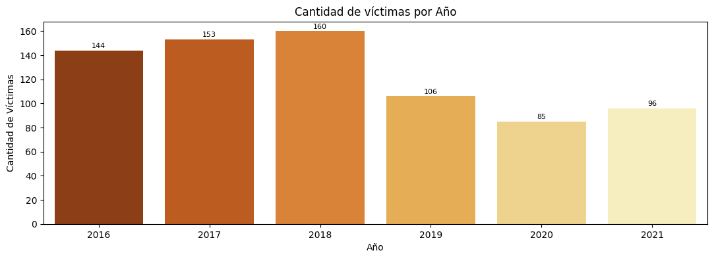
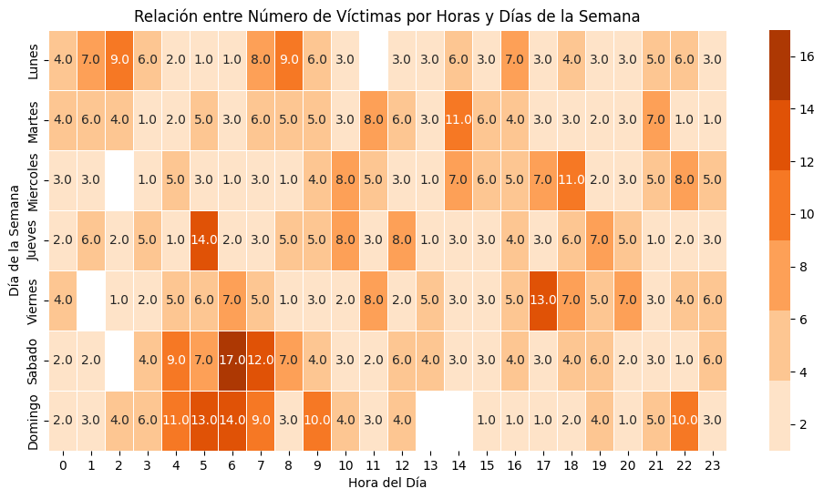
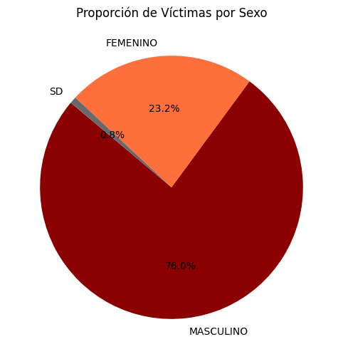
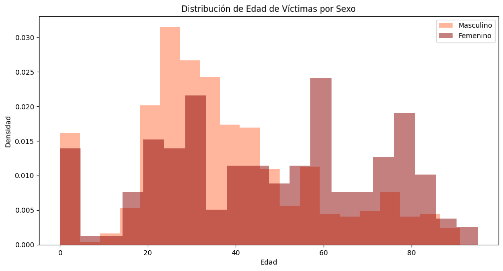
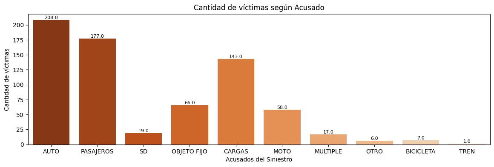
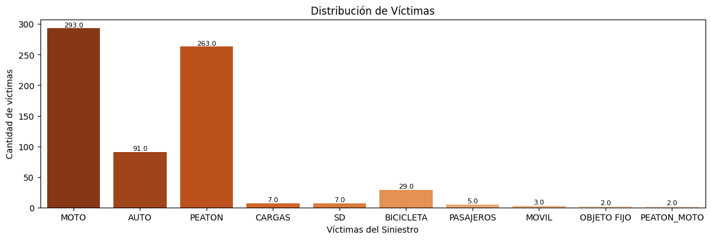
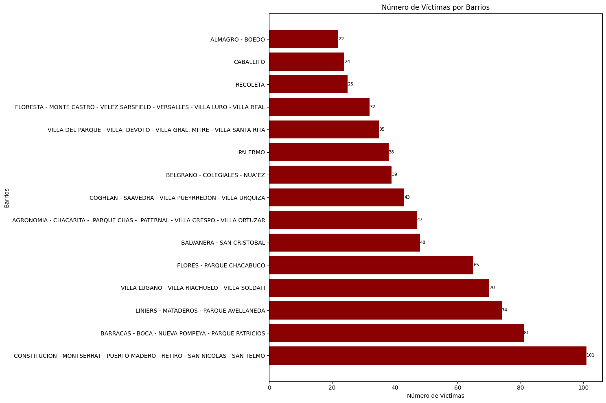
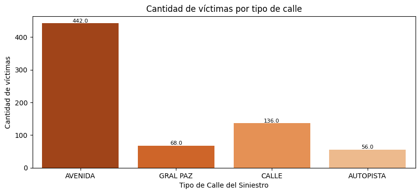

# PROYECTO DE ANÁLISIS DE DATOS DE SINIESTROS VIALES EN LA CIUDAD DE BUENOS AIRES
<h2>Gabriela Bergagna - DF21<h2>

<h2>Tabla de Contenidos</h2>

<ul>
  <li><a href="#introducción">Introducción</a></li>
  <li><a href="#contexto">Contexto</a></li>
  <li><a href="#desarrollo">Desarrollo</a>
    <ul>
      <li><a href="#etl">ETL</a></li>
      <li><a href="#eda">EDA</a></li>
      <li><a href="#kpi">INDICADORES DE RENDIMIENTO CLAVE - KPI</a></li>
    </ul>
  </li>
  <li><a href="#conclusiones">Conclusiones</a></li>
  <li><a href="#contenido">Contenido</a></li>
  <li><a href="#contacto">Contacto</a></li>
</ul>

<h2 id="introducción">Introducción</h2>

Este proyecto se desarrolló con el propósito de desempeñar las funciones de un Analista de Datos en nombre de una consultora, analizando los datos provenientes del Observatorio de Movilidad y Seguridad Vial (OMSV), vinculado a la Secretaría de Transporte de la Ciudad Autónoma de Buenos Aires (CABA).

El objetivo primordial de este análisis radica en examinar minuciosamente los datos recolectados para extraer conclusiones significativas sobre la movilidad y la seguridad vial en la región. Esto busca contribuir a la prevención de siniestros viales con consecuencias fatales y mejorar la seguridad vial en Buenos Aires.

Las tasas de mortalidad por siniestros viales son indicadores cruciales de seguridad vial en una región. Se busca reducir estas tasas, calculadas como el número de defunciones por habitantes o vehículos registrados, para proteger la vida de los ciudadanos.

Para lograr estos objetivos, se utilizó un conjunto de datos que detalla información sobre homicidios en siniestros viales en Buenos Aires entre 2016 y 2021. Estos datos son de acceso público y están disponibles en la página oficial de la Ciudad Autónoma de Buenos Aires.
 

<h2 id="contexto">Contexto</h2>

En Argentina, los siniestros viales causan alrededor de 4.000 muertes al año, siendo la principal causa de muertes violentas en el país. En la Ciudad Autónoma de Buenos Aires, con una densa población de más de 3 millones de habitantes, se registraron 3.828 muertes fatales en siniestros viales solo en 2022.

Esta problemática, que presenta una alta probabilidad de fatalidad en comparación con otros eventos delictivos, es de suma importancia para las autoridades locales y requiere un análisis detallado y acciones preventivas adecuadas.

<h2 id="desarrollo">Desarrollo</h2>

El desarrollo del proyecto se basa en la Base de Datos de Víctimas Fatales en Siniestros Viales, disponible en formato Excel a través del siguiente <a href=https://docs.google.com/spreadsheets/d/1nq00jGIZHQ1RLSET43zKnUsMsoFb-pBg/edit#gid=1625530738>enlace</a>. Esta base de datos consta de dos tablas principales:

<ul>
  <li><strong>HECHOS:</strong> Esta tabla proporciona información detallada sobre los siniestros viales, incluyendo la cantidad de víctimas y su relación temporal y espacial con el evento. Se registran datos como la ubicación del hecho, el día y la hora del incidente, entre otros. Además, se incluye información sobre los participantes involucrados en el siniestro.</li>
  <li><strong>VICTIMAS:</strong> En esta tabla se encuentra información específica sobre las víctimas de los siniestros viales, incluyendo su edad, sexo, medio de transporte y el rol que desempeñaban durante el incidente.</li>
</ul>

<h3 id="etl">ETL (Exploración, Transformación y Carga) </h3>

En la fase inicial, se llevó a cabo el proceso de exploración, transformación y carga de datos en ambas tablas, Hechos y Víctimas, para prepararlos de manera óptima para el análisis:

<ol>
  <li>Normalización de los nombres de las columnas para garantizar consistencia en los registros.</li>
  <li>Adecuación de los tipos de datos de las columnas para facilitar su manipulación y análisis.</li>
  <li>Identificación y eliminación de registros duplicados para mantener la integridad de los datos.</li>
  <li>Creación de nuevas columnas para almacenar las coordenadas x e y, extrayéndolas de otra columna existente.</li>
  <li>Fusión de la tabla de Hechos con la tabla de Víctimas utilizando un identificador único (ID) compartido.</li>
  <li>Generación de una nueva columna que indique el día de la semana correspondiente a la fecha del siniestro.</li>
  <li>Evaluación de la presencia de valores nulos para tomar medidas correctivas cuando sea necesario.</li>
  <li>Creación de una columna que clasifique a las víctimas en rangos etarios, con el fin de facilitar un análisis más detallado y específico.</li>
</ol>

<h3 id="eda">EDA (Análisis Exploratorio de datos) </h3>

Después de completar la limpieza de los tres conjuntos de datos, se llevó a cabo el Análisis Exploratorio de Datos (EDA). Este proceso implicó la elaboración de gráficos y visualizaciones con el objetivo de investigar y comprender las estadísticas, identificar valores atípicos y orientar investigaciones futuras.

<h4>Análisis Temporal</h4>

<

Se observa un marcado aumento en el número de víctimas de siniestros viales durante el año 2018, seguido de una notable disminución en el año 2020. Este fenómeno puede atribuirse a la declaración de la pandemia mundial y las subsiguientes restricciones de viaje y movilidad implementadas.

<h4>Análisis de Mapa de Calor</h4>

En el gráfico se puede apreciar que la incidencia más significativa de víctimas en siniestros viales ocurre los días sábados y domingos, particularmente durante el intervalo horario de 03:00 a.m. a 09:00 a.m. Además, se observa que durante el resto de la semana, los siniestros viales son más frecuentes entre las 07:00 a.m. y las 09:00 a.m., así como entre las 16:00 p.m. y las 20:00 p.m. Estos períodos coinciden con las horas de entrada y salida laboral, lo que sugiere una correlación con los desplazamientos asociados a las actividades laborales.

<h4>Análisis Demográfico</h4>

Se destaca que el 76% de las víctimas de siniestros viales son del sexo masculino.

<h4>Distribución de Edad de Víctimas por Sexo</h4>

Se presentan dos histogramas en el mismo eje para comparar las diferencias entre las víctimas de ambos sexos. Se puede observar que las víctimas de siniestros viales del sexo masculino tienen principalmente entre 20 y 40 años de edad, mientras que las víctimas del sexo femenino tienen edades distribuidas principalmente en los rangos de 30, 60 y 80 años.

<h4>Análisis de Participantes (Acusados-Víctimas)</h4>

En el gráfico se evidencia que los automóviles, junto con los pasajeros, son los principales involucrados en términos de la cantidad de víctimas en siniestros viales. Según la definición proporcionada en el diccionario de datos, un pasajero se refiere a cualquier persona que se encuentra dentro, descendiendo o ascendiendo del transporte público u omnibús de larga distancia.

En el gráfico se puede apreciar que las motocicletas, seguidas de los peatones, representan la mayoría de las víctimas en los siniestros viales ocurridos.

<h4>Análisis Geográfico</h4>

En el gráfico se pueden identificar un total de 15 comunas, compuestas por uno o varios barrios. Las comunas con mayor cantidad de víctimas en siniestros viales son las 1, 4, 9, 8 y 7. Es importante destacar que la comuna 1 alberga el microcentro de la Ciudad Autónoma de Buenos Aires, donde se concentra una gran cantidad de oficinas de trabajo. Por lo tanto, se supone que la alta incidencia de víctimas fatales en siniestros viales en esta zona puede estar relacionada con el tránsito durante las horas de entrada o salida laboral.

Se evidencia en el gráfico que las avenidas son el lugar donde ocurre la mayor cantidad de víctimas en siniestros viales, seguidas por las calles.

<h3 id="kpi">INDICADORES DE RENDIMIENTO CLAVE - KPI</h3>

Después de concluir el Análisis Exploratorio de Datos, se avanza hacia la implementación del conjunto de datos resultante en la herramienta Power BI. El objetivo es proyectar los KPI (Indicadores Clave de Rendimiento) en un dashboard y crear un panel de presentación del informe, así como una visualización efectiva de los datos.

<h4>Se proponen los siguientes KPI:</h4>

<ul>
  <li><strong>Reducir en un 10% la tasa de homicidios en siniestros viales de los últimos seis meses en CABA, en comparación con la tasa del semestre anterior.</strong> Esta métrica está vinculada al número de muertes por cada 100.000 habitantes y es el KPI principal. Una disminución en esta tasa sugiere que la población está siendo más cuidadosa al conducir, lo que puede traducirse en una menor cantidad de accidentes mortales.</li>
  <li><strong>Reducir en un 7% la cantidad de accidentes mortales de motociclistas en el último año en CABA, respecto al año anterior.</strong>  Dado que las motocicletas son uno de los medios de transporte con mayor número de fallecidos, es importante monitorear este KPI. Una disminución en la cantidad de fallecimientos en moto indica un mayor respeto tanto por los conductores de motocicletas como por las leyes de tránsito. Las motocicletas son más susceptibles a accidentes debido a la falta de respeto por las normas de tránsito, como por ejemplo, el no respetar las señales de tráfico.</li>
  <li><strong>Reducir en un 9% la cantidad de accidentes con víctimas fatales de peatones en el último año en CABA, respecto al año anterior.</strong> Este KPI está relacionado en parte con el anterior y puede indicar una falta de uso del cinturón de seguridad, así como una conducción imprudente. Una disminución en este indicador tendría un gran impacto en la cantidad total de accidentes fatales, señalando una mejora en la seguridad vial.</li>
</ul>

<h2 id="conclusiones">Conclusiones</h2>

Tras un detallado análisis de los homicidios en siniestros viales en la Ciudad de Buenos Aires entre 2016 y 2021, se extraen las siguientes conclusiones:

<ul>
  <li>De un total de 702 víctimas fatales, el 76% corresponde al sexo masculino, predominantemente en el rango de edad de 20 a 40 años. Además, el rol de conductor prevalece entre este grupo.</li>
  <li>Las avenidas son los lugares con mayor incidencia de siniestros, y las comunas 1, 4, 9, 8 y 7 registran la mayor cantidad de víctimas. En particular, el microcentro de la Ciudad Autónoma de Buenos Aires (Comuna 1) concentra un alto número de oficinas, lo que puede contribuir a los accidentes viales durante los horarios laborales.</li>
  <li>Los sábados y domingos, entre las 03:00 am y las 09:00 am, se observa el mayor número de víctimas en siniestros viales. Durante la semana, los horarios de mayor incidencia son entre las 07:00 am y las 09:00 am, y entre las 16:00 pm y las 20:00 pm, coincidiendo con los momentos de entrada y salida del trabajo.</li>
  <li>Las motocicletas son los vehículos más comúnmente involucrados en accidentes con víctimas, seguidas por los peatones. Por otro lado, los automóviles, colectivos y vehículos de carga son los más frecuentes entre los causantes de los accidentes.</li>
</ul>

Estas conclusiones proporcionan una visión clara de los patrones y factores asociados con los siniestros viales en la Ciudad de Buenos Aires, y señalan áreas clave para futuras intervenciones y políticas de seguridad vial.

<h3 id="contenido">Contenido</h3>

<h4>Contenidos de la Carpeta /notebooks</h4>

Esta carpeta contiene Jupyter Notebooks (.ipynb) con código completo y bien comentado. Aquí puedes encontrar diferentes secciones que detallan los procesos realizados:

<strong>ETL:</strong>

<ul>
  <li>Este notebook documenta el paso a paso de las Extracciones, Transformaciones y Cargas de datos.</li>
  <li>Incluye información sobre el pre-procesado y la calidad del dato.</li>
</ul>

<strong>EDA:</strong>

<ul>
  <li>En este archivo, encontrarás el proceso de Analítica Predictiva y Prescriptiva de las diferentes variables en nuestro conjunto de datos.</li>
</ul>

<strong>KPI:</strong>

<ul>
  <li>Este notebook proporciona una especificación técnica del Indicador Clave de Desempeño (KPI).</li>
  <li>Ofrece una visión general de los objetivos y particularidades del KPI.</li>
</ul>

Cada notebook está diseñado para proporcionar una comprensión detallada de su respectivo proceso. Si tienes alguna pregunta o necesitas más detalles, no dudes en explorar los archivos correspondientes.

<h3>Contenidos de la Carpeta /datasets</h3>

Esta carpeta almacena los datasets tanto originales como resultantes después de los procesos de ETL y EDA. Aquí encontrarás las siguientes versiones de los datos:

<strong>homicidios y lesiones (Formato: xlsx):</strong>

<ol>
  <li>Archivos que representan nuestras fuentes de datos originales.</li>
</ol>

<strong>homicidios_limpio y lesiones_limpio (Formato: csv):</strong>

<ol start="2">
  <li>Archivos resultantes de la limpieza realizada durante el proceso de ETL.</li>
</ol>

<strong>siniestros (Formato: csv):</strong>

<ol start="3">
  <li>Archivo que integra todos los datos de siniestros viales, tanto fatales como no fatales.</li>
</ol>

<strong>provincias (Formato: csv):</strong>

<ol start="4">
  <li>Archivo utilizado para el KPI propuesto.</li>
</ol>

Cada archivo en esta carpeta representa una versión específica de los datos en diferentes etapas de procesamiento. Si requieres más detalles sobre la estructura o contenido de alguno de estos conjuntos de datos, puedes explorar los archivos directamente.

/dashboard:

Se encuentra almacenado el dashboard de extensión .pbix (desarrollado en Power Bi).

<h2 id="contacto">Contacto</h2>

Si deseas realizar alguna consulta, compartir alguna sugerencia o simplemente ponerte en contacto conmigo, puedes hacerlo a través de las siguientes vías de comunicación:

<ul>
  <li>Correo Electrónico: gabrielabergagna@gmail.com</li>
  <li>LinkedIn: <a href="link">[link](https://www.linkedin.com/in/gabriela-bergagna/)</a></li>
</ul>

